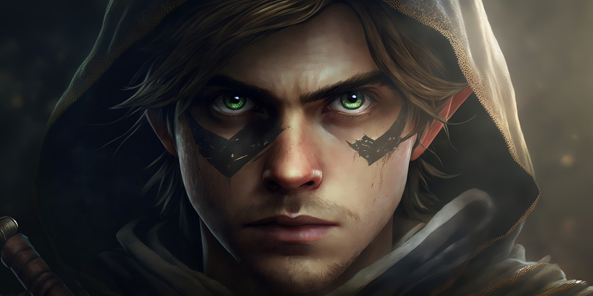
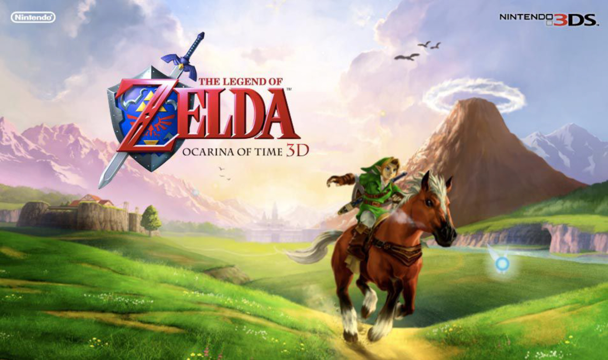

# Song of Storms

To view the __[YouTube video](https://youtu.be/WxbQ2BDVnvQ)__ of this multimedia musical production, please click on the image above or follow this link: [Song of Stroms](https://youtu.be/WxbQ2BDVnvQ)

## 1. Project objective (why & what)
To craft a miniature prototype of a futuristic orchestra’s music that __`blends human performance and technology-generated music`__, I led a team of seven enthusiasts in this reimagination of the "Song of Storms" from the iconic "Legend of Zelda" video game series. My piano melodies integrate with the __enchanting sounds__ from __`VST sample-based synthesizer plugins`__, __`Google's NSynth neural synthesizer`__, __`physics-based synthesizers`__ built with the __`ChucK`__ music programming language, __`AI-powered Vocaloid`__, and human vocals.

## 2. Background for "The Legend of Zelda" and "Song of Storms"
"The Legend of Zelda," an iconic video game series that first captivated my brother Michael, showcases the enthralling __"Song of Storms__," composed by Koji Kondo. Despite the eight-year age gap between my brother and me, this melody has enthralled me, recurring throughout the series and seizing my heart and imagination. Its bewitching tune strikes a chord within me, creating an indelible memory.

  

In "The Legend of Zelda: Ocarina of Time," the adult incarnation of Link acquires the mesmerizing "Song of Storms" from the Phonogram Man within the confines of the Kakariko Windmill. This bewitching tune harbors remarkable abilities; upon its performance, it can conjure rain, reveal hidden grottoes, and nurture Magic Bean sprouts to yield Fairies.

Across the expansive realm of Hyrule, there are distinct locales where Navi, Link's fairy ally, glows green. In these instances, should Link perform the "Song of Storms," he can summon a wingless Fairy who arrives to replenish his Hearts and Magic Meter, rejuvenating his vitality for the quests that lie ahead.

Fascinatingly, the mystical influence of the "Song of Storms" extends even beyond its melody. When Link, as a child, plays this entrancing tune inside Kakariko Windmill, it causes the windmill to spin at a dramatically increased velocity. This unexpected acceleration of the windmill's blades results in the draining of the well, unveiling the enigmatic realm of the Bottom of the Well. Here, new challenges and hidden secrets lie in wait.

The musical is composed of seven distinct sections.

 

Every one of us assumes a distinct role in each section:
- __Introduction -__ Main Instrument (Piano): Jeffrey
- __Part I -__ Singer(s): Amie & Brandon; Main Instrument (Piano): Jeffrey
- __Part II -__ Singer(s): AI Singers--[MERROW & NAKUMA](https://studio-neutrino.com/); Main Instruments (__Piano, NSynth and ChucK__): Jeffrey & [Google NSynth Device](https://experiments.withgoogle.com/nsynth-super)
- __Part III -__ Singer(s): Brandon; Main Instrument (Piano): Jeffrey
- __Part IV -__ Singer(s): Wendy; Main Instrument (Piano): Frank
- __Part V -__ Singer(s): ALL; Main Instrument (Piano): Frank
- __End -__ Main Instrument (Piano): Frank

Below you will find the musical scores for each section.

Dive into the world of __"The Legend of Zelda"__ and allow the __"Song of Storms"__ to transport you on an adventure brimming with __enchantment, exploration, and boundless possibilities__.

## 3. Experimentation with Music Technologies (how)
We fused the heartfelt expressions of live musicians with the cutting-edge sounds of technology-crafted melodies and AI-augmented vocaloids. Venturing beyond the confines of conventional Digital Audio Workstation (DAW) production, we created a novel musical experience by harnessing the the flexible ChucK music programming language, the pioneering Google Nsynth neural synthesizer, and innovative capabilities of AI vocaloids.

  

### 3.1 ChucK - Music Programming Language

We have chosen [__ChucK__](https://chuck.stanford.edu/), a programming language designed for real-time sound synthesis and music creation, as one of our primary tools for Part II music generation.
- The ChucK codes we've implemented for various instruments are located within the "chucK" directory. We have refined the synthesizer codes I initially developed in a separate project for __`cymbal`__, __`rainstick`__, __`glockenspiel`__, and __`vibraphone`__.
- The music score for ChucK can be found at: __chucK/SongOfStroms_Part02.mscz__.
- The melody generated from ChucK synthesizers can be found at: __chuck/chuck_part02.wav__.

Instructions for downloading and using ChucK:
- Download ChucK here: [ChucK](https://chuck.stanford.edu/)
- Save the generated music as a .wav file: 
  - Follow the [instructions](http://learningChuck.blogspot.com/2012/05/saving-to-wav-files.html) in this blog.
  - Open a command/terminal application, type "chucK score.ck rec-auto.ck -s" 

### 3.2 Google NSynth Super - AI-Power Synthesizer
 

[__Google NSynth Super__](https://nsynthsuper.withgoogle.com/) is an open-source experimental musical instrument, built by the Magenta and Creative Lab teams at Google using TensorFlow and openFrameworks. It gives musicians the ability to make music using completely new sounds generated by the NSynth algorithm from 4 different source sounds. In Part II, the __marimba__'s sound is synthesized using NSynth.

I assembled the instrument based on the [open-source](https://github.com/googlecreativelab/open-nsynth-super) __PCB schematics__ and the __BOM list__ saparately in another project, to delve into how machine learning tools can offer artists novel avenues for creating music. 

If you're interested in crafting your own, follow the instructions at [Open NSynth](https://github.com/googlecreativelab/open-nsynth-super).

 

### 3.3 AI Vocaloids (Merrow and Nakumo)

__`Vocaloid`__ is a singing voice synthesizer software. The integration of __`Vocaloid`__ into our project was both a source of inspiration and a challenge, one that was introduced by my brother, Michael. It was he who first exposed me to "The Legend of Zelda." As an avid fan of Hatsune Miku, a prominent Vocaloid from his time, Michael presented this creative challenge to our team. Spurred by his passion, we commenced our foray into the world of Vocaloids.

__Merrow__ and __Nakumo__ are AI-powered vocaloids, available at [Studio Neutrino](https://studio-neutrino.com/).

The NEUTRINO Diffusion—an AI-powered Singing Voice Generator offered as freeware by Studio Neutrino—leverages artificial intelligence to analyze musical scores and generate vocals independently. Mastering this tool was challenging due to its instructions being available exclusively in Japanese. However, after dedicating time to unravel its features, we have acquired significant understanding, which we detail further below. This language barrier is the reason why Merrow and Nakumo's vocals are in Japanese rather than English.

Step-by-step instructions:
- Download the NEUTRINO/Voicebanks from [Neutrino - Diffusion Google Drive](https://drive.google.com/drive/folders/1cDicMle0z0y6zRLbQp3dD2kI-Zn21YHC)
- Unzip the NEUTRINO folder from the appropriate file for your operating system and save it onto your local drive. 
- The MERROW voicebank is included with the NEUTRINO package by default. If you wish to use a different voicebank, you can download them from [Neutrino - Diffusion Google Drive](https://drive.google.com/drive/folders/1cDicMle0z0y6zRLbQp3dD2kI-Zn21YHC). After downloading, extract the voicebank and place it in the NEUTRINO/model folder.
- The NEUTRINO package comes with three sample scores by default. If you're interested in using more scores, consider downloading and installing [MuseScore](https://musescore.com/dashboard). Additionally, I have included custom scores crafted expressly for this project, located within the "NEUTRINO" subfolder. Please note that NEUTRINO only processes lyrics in Hiragana or Katakana. To have a Vocaloid perform in other languages, a phonetic translation must be conducted first.
- Edit the NEUTRINO/Run.bat script to specify the desired score (BASENAME) and voicebank (ModelDir).
- Open a command/terminal application, navigate to the NEUTRINO folder, and then run the Run.bat file.
- The generated sound files can be found in the NEUTRINO/output folder.

## 4. Final production
Our team of seven: 

 

Snapshots from various parts of the musical:

__Introduction__

 

__Part I__

  

__Part II__

  

__Part III__

  

__Part IV__

  

__Part V__

 

__Ending__

 

Good luck and have fun!!!!! Should you run into any issues, please feel free to contact us at jeffrey.luo333@gmail.com

